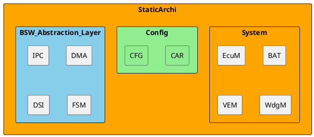
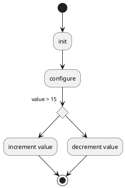

# Detailed Design Document

| **Author**              | `Authors Name`                                       |
|:------------------------|:-----------------------------------------------------|
| **Status**              | `Draft/Inspection/Approved`                          |
| **Version**             | `1.0`                                                |
| **Date**                | `dd/mm/yyyy`                                         |

## Introduction

This document provides a detailed overview of the temperature monitoring system that was developed using an LCD display and a temperature sensor. It explains the module's design, functionality, and configuration, ensuring clarity on how it operates within the overall system.
### Purpose
The purpose of this document is to explain the functionality of the temperature monitoring module. This module reads the temperature using a sensor, allows users to set high and low temperature limits using buttons on the LCD keypad shield, and displays whether the temperature is within or outside the acceptable range

### Scope
The system is designed to monitor temperature in a user-defined range. If the temperature exceeds or falls below the specified range, the module displays a "Not Okay" message and activates an LED indicator. The buttons on the LCD keypad shield let users adjust the high and low temperature limits dynamically.

## Architectural Overview

The module resides within the software architecture, interacting with components such as the LCD, temperature sensor, and LED indicator. The architecture also supports user input through the buttons on the LCD keypad shield.

### Assumptions & Constraints
The design assumes the following:

The temperature sensor is calibrated and provides accurate readings.
The LCD keypad shield is correctly wired to the microcontroller.
Memory and processing resources are sufficient for real-time updates.
Constraints include:

Limited memory availability for storing custom configurations.
Button debounce timing must be carefully handled to avoid incorrect limit adjustments.

## Functional Description
The module performs the following functions:

Reads the current temperature using a sensor.
Displays the temperature and user-defined limits (LH and LL) on the LCD.
Uses the "Up" and "Down" buttons to adjust the high and low temperature limits.
Checks if the current temperature is within the range.
Displays "Okay" if the temperature is within the range or "Not Okay" if it is outside.
Activates an LED when the temperature is out of range.

## Implementation of the Module
The module consists of several interconnected components:

Temperature Reading: Reads the sensor value, converts it to a temperature, and displays it.
User Interaction: Monitors button presses to adjust limits dynamically.
Validation Logic: Compares the current temperature against the limits.
LED Control: Activates or deactivates the LED based on range validation.

